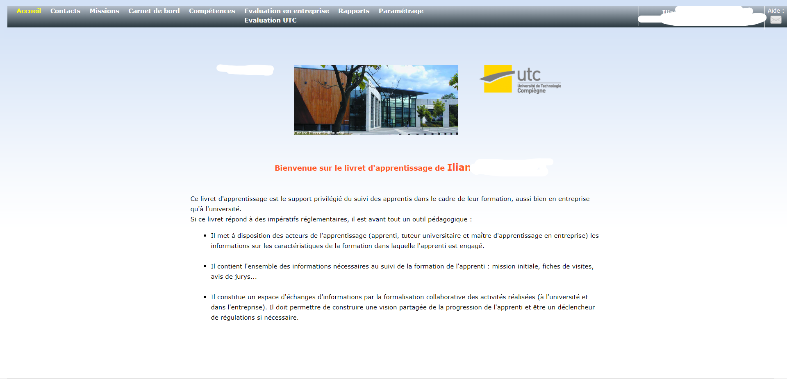
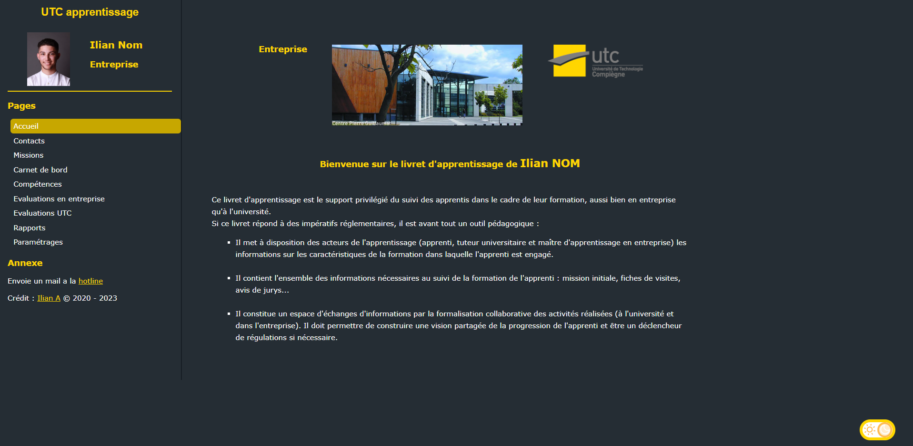
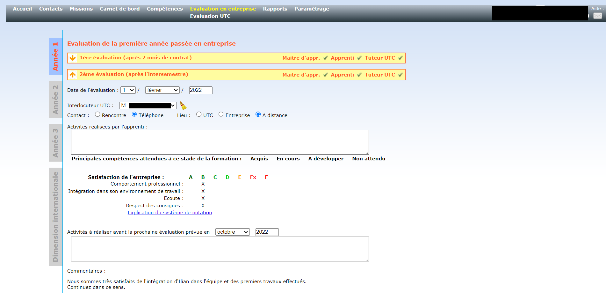
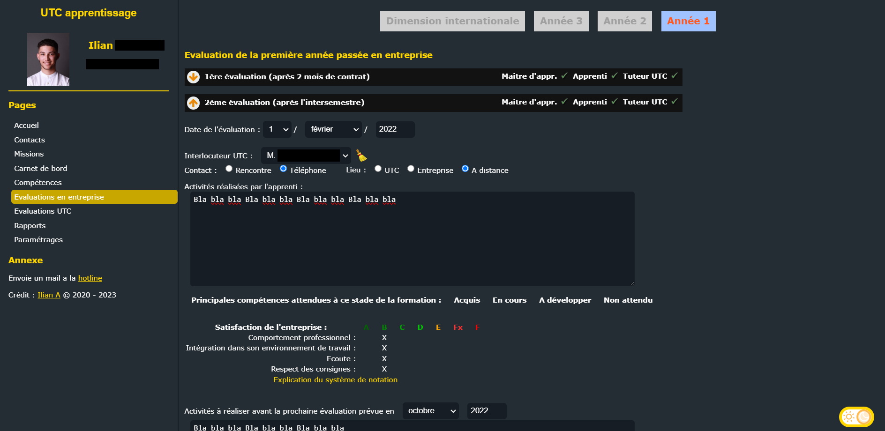
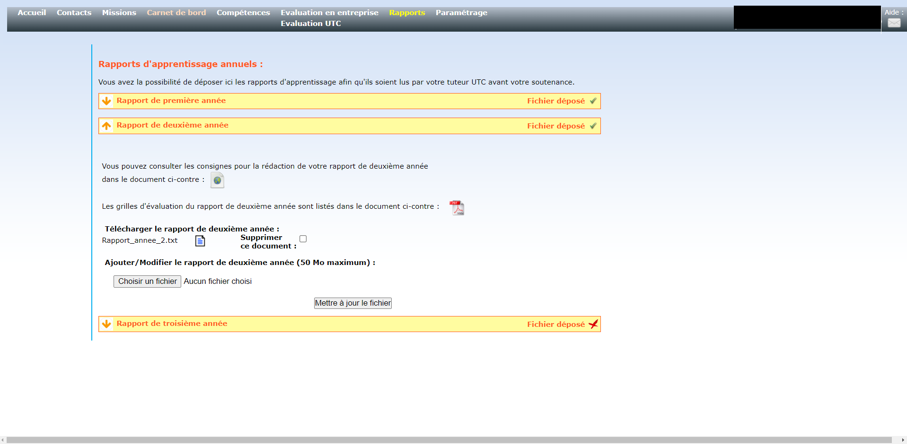
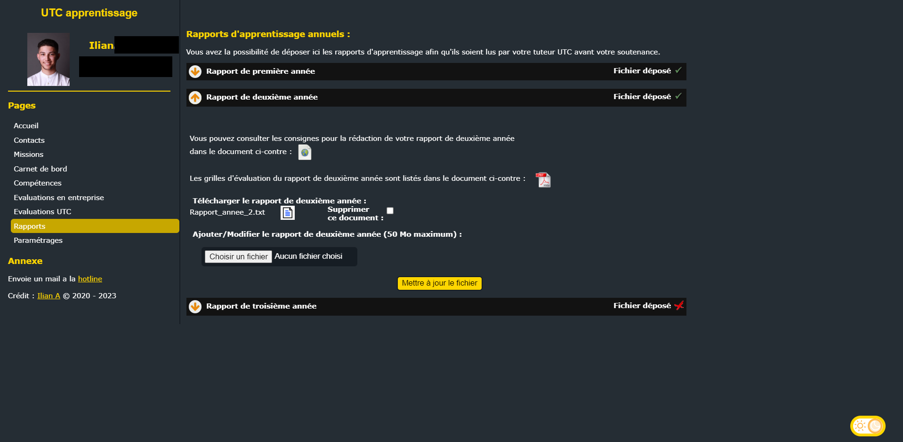

# UTC Skin Livret d'apprentissage

Extension **Chrome** (Tous les navigateurs basés sur chromium : Edge, Brave, Opera, Blisk...) qui rend le livret d'apprentissage de l'UTC un peu plus joli.

Il y a que très peu de modifications d'élèments, c'est surtout du CSS.

## Avant / Après

### Accueil

### Evaluations

### Rapports

## Installation

J'ai pas fait les démarches pour le mettre sur le store, donc il faut l'installer manuellement.

-   Télécharger le projet en cliquant sur le bouton vert "Code" puis "Download ZIP",
-   Extraire le dossier,
-   Activer le mode développeur dans votre navigateur,

    -   Pour Chrome :
        -   Aller sur [chrome://extensions/](chrome://extensions/),
        -   Activer le mode développeur en haut à droite,
    -   Pour Edge :
        -   Aller sur [edge://extensions/](edge://extensions/),
        -   Activer le mode développeur à gauche,
    -   Pour Brave :
        -   Aller sur [brave://extensions/](brave://extensions/),
        -   Activer le mode développeur en haut à droite,

-   Charger l'extension non empaquetée,
-   Selectionner le dossier "UTC-Skin-Livret-Apprentissage-main" (le dossier qui contient le fichier manifest.json),

Et voilà, l'extension est installée !
